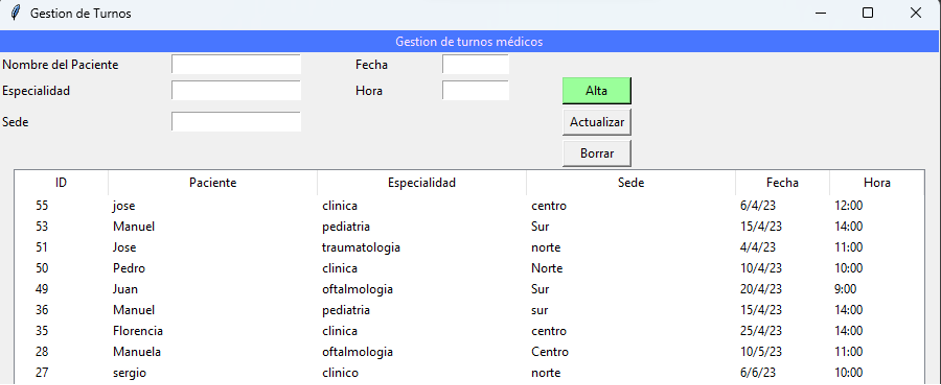
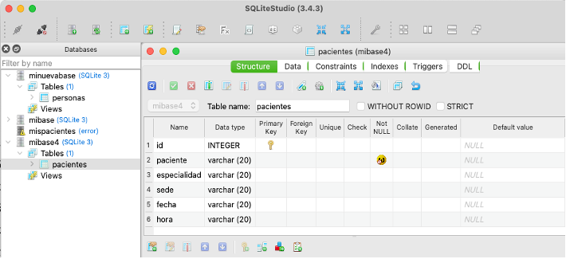
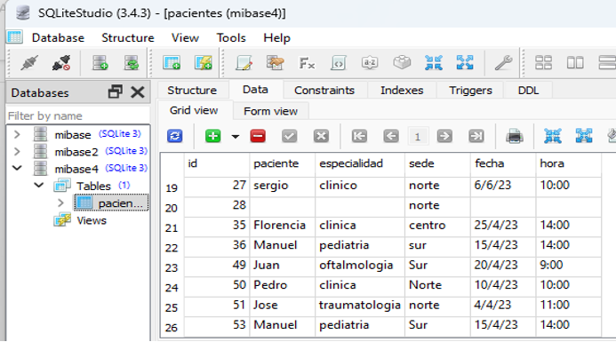
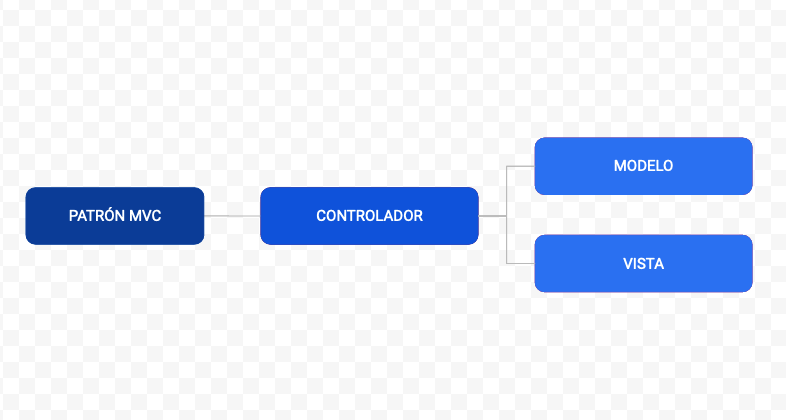
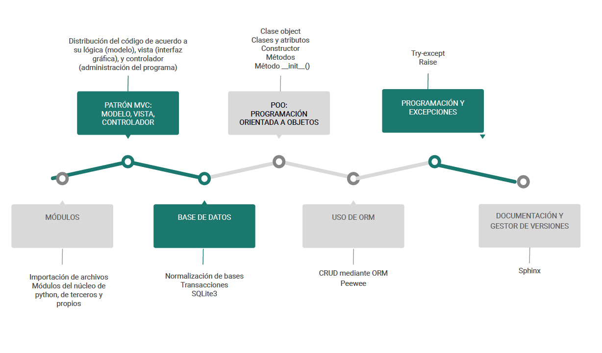

   
Aplicación de Turnos Médicos
======================================

Bienvenido a la documentación de la aplicación para gestión de turnos médicos

.. toctree::
   :maxdepth: 10
   :caption: Contenidos:
   :caption: Índice y referencias:
   :caption: Manual de Usuario:
   :caption: Base de Datos:
   :caption: Patrón MVC:
   :caption: Implementación de excepciones:
   :caption: Resumen gráfico:

   modelo
   vista
   controlador
   
Índice y referencias
========================

* :ref:`genindex`
* :ref:`modindex`
* :ref:`search`

Manual de Usuario
======================================

Objetivo
--------------------------------

La aplicación de software para la gestión de turnos médicos tiene como finalidad 
permitir a las instituciones de salud (hospital, clínica, sanatorio) 
la gestión (toma de datos, registro y modificación) de turnos conforme a la base de datos 
de los diversos usuarios/pacientes. 

Funcionamiento
--------------------------------

La administración de turnos de pacientes utiliza la plataforma de interfaz gráfica 
de usuario Tkinter donde se lleva a cabo el alta de los datos ingresados. 
Los datos son almacenados y gestionados en la base de datos relacional SQLite.

Base de Datos
======================================

Registro en la Base de Datos
--------------------------------

En la creación de una base de datos (“mibase4.db”) y de una tabla (pacientes) 
se encuentra el registro de los parámetros (paciente, especialidad, sede, fecha, y hora del turno). 
A través de la interfaz gráfica (Tkinter) se solicita al usuario que ingrese los datos mediante campos del tipo Entry. 
Los datos son guardados en la base de datos como se muestra a continuación y mostrados en el Treeview. 

Clase Abmc
--------------------------------

La información (es decir, los parámetros) es transmitida a la clase Abmc(), a través de un constructor. 
La clase Abmc() a su vez contiene los métodos: alta, actualizar_treeview, borrar y actualizar, 
y se conecta a la Base de Datos relacional SQLite3. El siguiente es solo un breve extracto del mismo.

>>> class Abmc:
>>>     def __init__(self, ): pass  

>>>     def alta(self, paciente, especialidad, sede, fecha, hora, tree):
>>>         datos_turno = Pacientes()
>>>         datos_turno.paciente = paciente.get()
>>>         datos_turno.especialidad = especialidad.get()
>>>         datos_turno.sede=sede.get()
>>>         datos_turno.fecha=fecha.get()
>>>         datos_turno.hora=hora.get()
>>>         datos_turno.save()
            
>>>         self.actualizar_treeview(tree)

Conexión a la Base de Datos
--------------------------------

Desde el modelo, hemos llevado a cabo la implementación del ORM, en este caso mediante la instalación de peewee, 
mediante el cual, al memento que se lanza la aplicación, se crea la estructura de la base de datos. 

.. py:function:: db = SqliteDatabase("mibase4.db")

Mediante la instrucción que figura arriba le indicamos a peewee con qué base de datos trabajamos, esto es indicado pasando la clase SqliteDatabase.
A su vez, el objeto db me permite tener conexión con la base de datos.

A continuación se puede observar una estructura que utiliza la clase BaseModel y se conecta con el objeto que,
como ya se ha explicado, se conecta a la base datos.

>>> class BaseModel(Model):
>>>     class Meta:
>>>        database = db

La clase Pacientes es la tabla en nuestra base de datos, y los atributos que declaro luego (paciente, especialidad, sede, etc.)
son las columnas, es decir, clases y atributos son transformados por el ORM en tabla y columnas. 

>>> class Pacientes(BaseModel):
>>>     paciente = CharField()
>>>     especialidad = CharField()
>>>     sede = CharField()
>>>     fecha = CharField()
>>>     hora = CharField()

>>> db.connect()
>>> db.create_tables([Pacientes])

Patrón MVC
======================================

El código se encuentra estructurado de acuerdo al paradigma POO (Porgramación orientada a objetos) 
y separado de acuerdo al patrón MVC, esto es: Modelo, Vista y Controlador.

Modelo
--------------------------------

Se trata de la parte lógica del programa donde se comunica con la base de datos, posee la clase Abmc() 
y ejecuta los métodos principales (alta, borrar, actualizar). 

Este modelo además contiene el intérprete (ORM: Object-relational mapping) del tipo Peewee, 
esto permite que el código sea independiente del administrador de la base de datos a utilizar. 
El ORM se encarga de transformar lo que hago en Python en registros (base de datos) y darle un objeto con el cual trabajar. 

Vista
--------------------------------

La interfaz gráfica está conformada por 6 parámetros: 
paciente, especialidad (ej., clínica, traumatología, oftalmología, y otros), sede, fecha, y hora del turno. 
La visualización de la información es llevada a cabo a través del control Treeview conformado por 6 columnas 
(una de las cuales contiene un ID autoincremental) definidas mediante el método grid. 
Además, la interfaz gráfica integra tres botones: alta, actualizar y borrar definidos previamente 
mediante la declaración de sus correspondientes funciones. Dichas funciones pasan los parámetros hacia 
los métodos de clase Abmc() que está en el módulo modelo.
Al cargar los datos correspondientes a los parámetros el usuario (responsable de la gestión de los datos)
podrá visualizar en la interfaz gráfica cómo los datos se integran a las columnas asignadas del Treeview y, por otra parte, 
se puede verificar y validar cómo los mismos son guardados dentro de la base de datos “mibase4.db”.

>>> def vista_alta(self,):
>>>        retorno = self.objeto_base.alta(self.a_val, self.b_val, self.c_val, self.d_val, self.e_val, self.tree)
>>>        print(retorno)
>>>        showinfo("El alta de registro ha sido confirmada", retorno,)

>>>    def vista_borrar(self, tree):
>>>        retorno = self.objeto_base.borrar(tree)
>>>        showinfo("El registro ha sido eliminado",
>>>        retorno,)

>>>    def vista_actualizar(self,):
>>>        self.objeto_base.actualizar(self.a_val,self.b_val, self.c_val, self.d_val, self.e_val, self.tree,)

Controlador
--------------------------------

Este es el módulo que administra el lanzamiento de la App y su interfaz gráfica así como la lógica de control del mismo.

>>> if __name__ == "__main__":
>>>    master_tk = Tk()
>>>    obj1 = Ventana(master_tk)
>>>    master_tk.mainloop()

Implementación de excepciones
======================================

Dentro del modelo, se encuentra en este caso, la ejecución de una excepción (try-except). 
Esto se ha realizado mediante el uso de una clase RegistroLogError(Exception) que hereda de Exception:

.. py:function:: class RegistroLogError(Exception)

   Esto nos permite personalizar nuestra excepción mediante la clásula "raise":

>>> class RegistroLogError(Exception):
>>>   BASE_DIR = os.path.dirname(os.path.abspath(__file__))
>>>   ruta = os.path.join(BASE_DIR, "log.text")

>>>   def __init__(self, paciente, fecha, hora):
>>>     self.paciente = paciente
>>>     self.fecha = fecha
>>>     self.hora = hora

>>>   def registrar_error(self):
>>>     log = open(self.ruta, "a")
>>>     print("Se ha dado un error: ", self.paciente, self.fecha, self.hora, file=log)

>>> def registrar():
>>>     raise RegistroLogError("25", "archivo.txt", datetime.datetime.now())
      
>>> try:
>>>   registrar()
>>> except RegistroLogError as log:
>>>   log.registrar_error()

Resumen gráfico
======================================

Esquema visual de los contenidos fundamentales implementados y utilizados 
dentro de esta aplicación 

